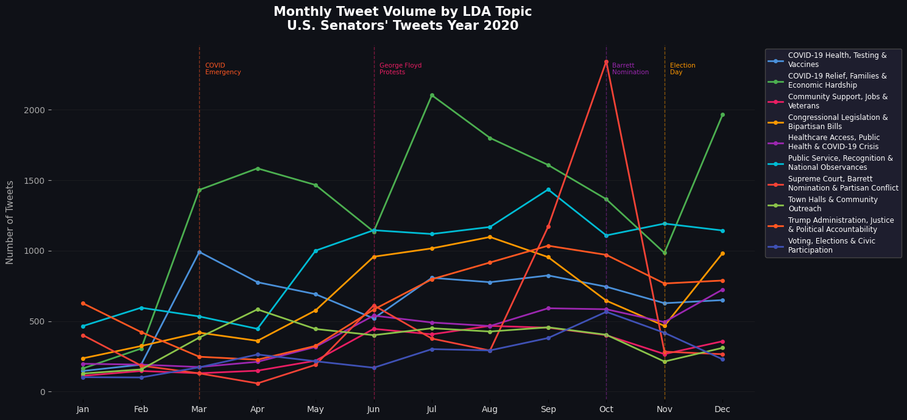
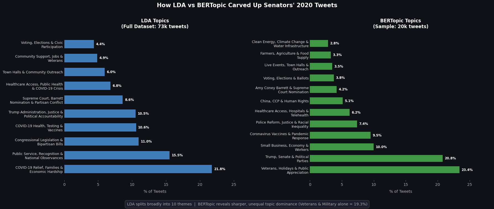
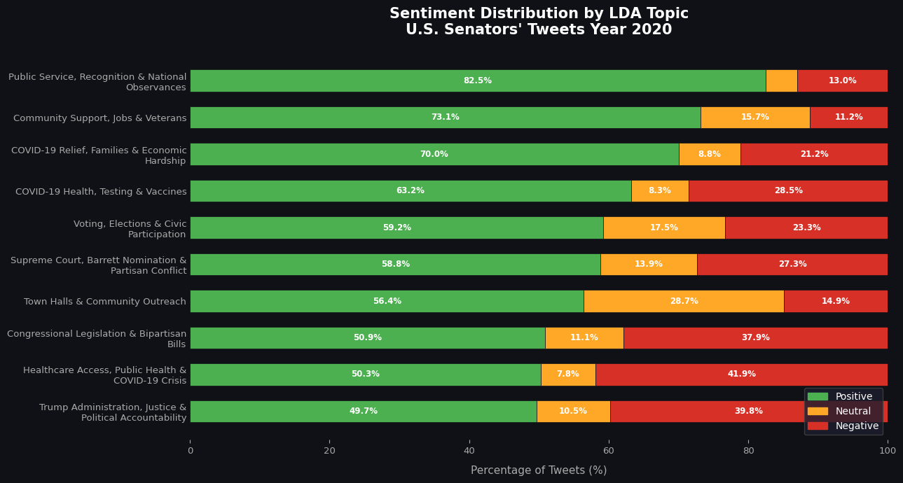
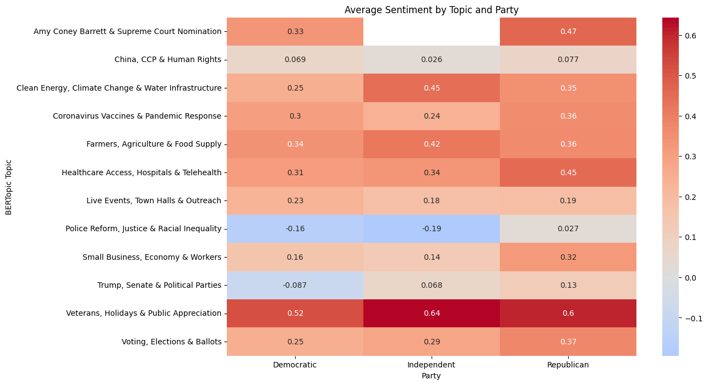
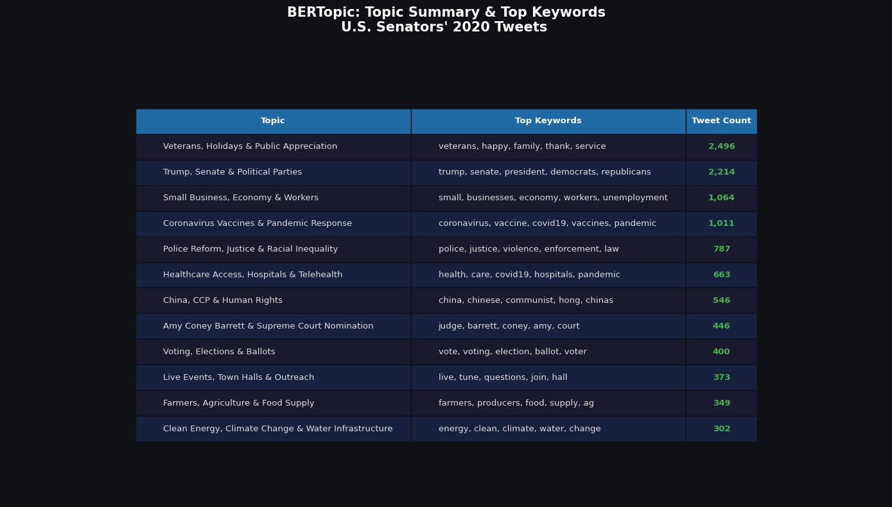

# senator-tweet-sentiment-analysis
Topic-driven sentiment analysis of 73K U.S. senator tweets using LDA and BERTopic, comparing political framing and partisan tone across major 2020 events.

## Overview

Analyzed 73,111 tweets posted by 93 U.S. senators throughout 2020 which is one of the most turbulent political years in recent history (COVID-19, the presidential election, nationwide protests, and the Amy Coney Barrett Supreme Court nomination) to answer two questions:

1. Once major political topics are identified, how does sentiment differ across those topics?
2. Are Republican or Democratic senators more likely to express negative sentiment on COVID-19, elections, or legislation?

## Approach

- **Data prep:** Two separate preprocessing pipelines — heavy cleaning (lowercasing, stopword removal, lemmatization via NLTK) for LDA, and lighter cleaning that preserves sentence structure for BERTopic.
- **Topic modeling:** Compared **LDA** (Gensim, 10 topics on the full 73K tweets) against **BERTopic** (a random 20,000-tweet sample, using `paraphrase-MiniLM-L3-v2` embeddings, PCA to 50 components, and HDBSCAN clustering).
- **Sentiment analysis:** **VADER** compound scores, aggregated by topic and by party (all 93 senator accounts manually mapped to party affiliation, since no such mapping existed in the source data).

## Key findings

- **BERTopic outperformed LDA** on this short-text data: 12 specific, interpretable topics with a topic diversity score of **0.92**, versus LDA's 10 broader topics at a coherence score of **0.4803**.
- 

- Sentiment is strongly topic-dependent — **Public Service & National Observances** was the most positive LDA topic (82.5% positive), while **Trump Administration, Justice & Political Accountability** and **Healthcare Access & COVID-19 Crisis** were the most negative (39.8% and 41.9% negative, respectively).
  

- By party, Democratic senators skewed more negative on **Police Reform, Justice & Racial Inequality** (avg. sentiment −0.16) while Republicans framed the same topic positively (+0.03) — a pattern that repeated on Trump/Senate/Political Parties topics.
- One topic united everyone: **Veterans, Holidays & Public Appreciation** scored positively across all three parties (+0.51 to +0.64).
  

- BERTopic's main limitation was a high outlier rate (~47% of the sample was unclustered), noted as a direction for future tuning.
  

## Tech stack

`Python` · `Gensim (LDA)` · `BERTopic` · `sentence-transformers` · `HDBSCAN` · `scikit-learn (PCA)` · `NLTK` · `VADER`

## Data source

[US Senators 2020 Tweets (73K)](https://github.com/vjavaly/Baruch-CIS-9665/blob/main/data/US_senators_2020_tweets_73k.csv)
